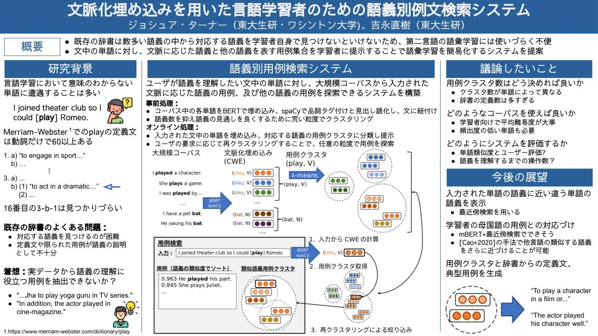

# 文脈化埋め込みを用いた言語学習者のための語義別例文検索システム

NLP若手の回（YANS)で発表させていただいた研究です。

[](poster.pdf)

## データのダウンロード
```shell
wget https://dumps.wikimedia.org/other/cirrussearch/current/enwiki-20210802-cirrussearch-content.json.gz
```


## 事前処理
```shell
python ingest_sentences.py --input wiki --run yans
python embed_words.py --run yans
./postprocess_data.sh yans
```

## ウェブUI
```shell
RUN=yans uvicorn web:app
```


# For definition generation

```shell
CUDA_VISIBLE_DEVICES="2" python ingest_examples.py --input ../generationary_emnlp/data/corpora/orig/chang_seen_valid.contexts.txt
```

